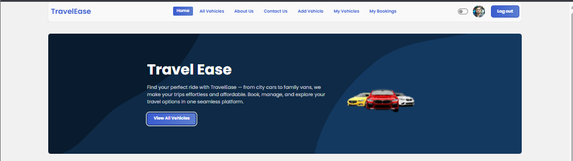
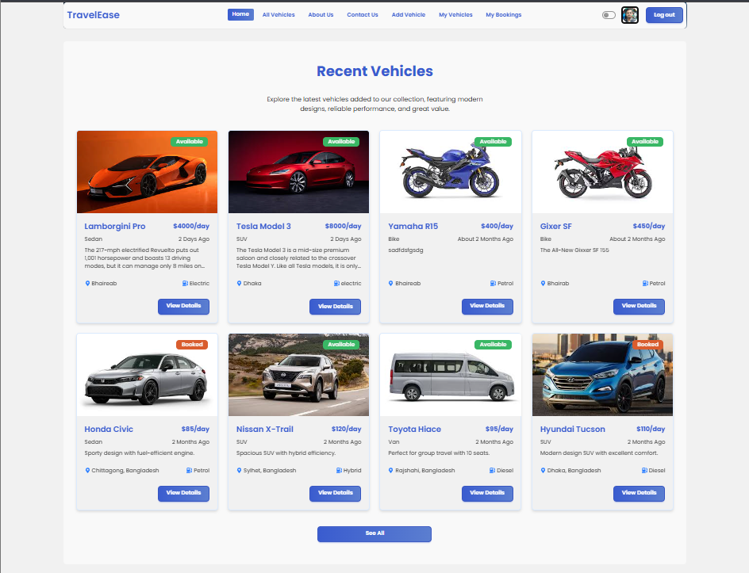

# 🚗 TravelEase – Vehicle Booking & Trip Management Platform

[](https://travel-ease-by-mobin.netlify.app)
[](https://reactjs.org/)
[](https://firebase.google.com/)
[](https://tailwindcss.com/)

## 📖 About TravelEase

TravelEase is a modern, full-stack MERN application that revolutionizes vehicle booking and trip management. Users can explore a wide variety of vehicles, book trips seamlessly, manage their bookings, and even list their own vehicles for rent. Built with the latest technologies and best practices for optimal performance and user experience.

## 🖼️ Screenshots

### Homepage Banner


### Recent Vehicles Section


## ✨ Key Features

### 🔐 Authentication & Security
- **Firebase Authentication** with Email/Password and Google Sign-In
- **JWT Token-based** API authentication with automatic refresh
- **Protected Routes** for secure user areas
- **Role-based Access Control** for different user permissions

### 🚙 Vehicle Management
- **Browse All Vehicles** with advanced filtering and search
- **Detailed Vehicle Information** with high-quality images
- **Add Your Own Vehicles** with comprehensive form validation
- **Update & Delete** your listed vehicles
- **Real-time Availability** status tracking

### 📅 Booking System
- **Instant Vehicle Booking** for available vehicles
- **Booking History** with detailed information
- **Cancel Bookings** with confirmation dialogs
- **Email Notifications** for booking confirmations

### 🎨 User Experience
- **Responsive Design** optimized for all devices
- **Dark/Light Theme** toggle for user preference
- **Loading States** and skeleton loaders
- **Toast Notifications** for user feedback
- **Error Boundaries** for graceful error handling

### 📊 Dashboard Features
- **Personal Dashboard** with booking statistics
- **My Vehicles** management interface
- **My Bookings** tracking and management
- **User Profile** customization

## 🛠️ Tech Stack

### Frontend
- **React 19.2.0** - Latest React with modern hooks and features
- **React Router 7.9.5** - Client-side routing with nested routes
- **Vite 7.1.7** - Lightning-fast build tool with HMR
- **Tailwind CSS 4.1.17** - Utility-first CSS framework
- **DaisyUI 5.4.7** - Beautiful component library
- **Axios 1.13.2** - HTTP client with interceptors
- **React Hook Form 7.69.0** - Performant form library
- **React Toastify 11.0.5** - Toast notifications
- **SweetAlert2 11.26.3** - Beautiful modal dialogs
- **Recharts 3.6.0** - Data visualization library
- **React Icons 5.5.0** - Comprehensive icon library

### Backend & Services
- **Node.js & Express.js** - Server-side runtime and framework
- **MongoDB** - NoSQL database for data storage
- **Firebase** - Authentication and hosting services
- **Vercel** - Backend deployment platform
- **Netlify** - Frontend deployment platform

### Development Tools
- **ESLint** - Code linting and formatting
- **Vite** - Development server and build tool
- **Git** - Version control system

## 🚀 Getting Started

### Prerequisites
- Node.js (v18 or higher)
- npm or yarn package manager
- Firebase account for authentication
- MongoDB database

### Installation

1. **Clone the repository**
   ```bash
   git clone https://github.com/your-username/travel-ease-client.git
   cd travel-ease-client
   ```

2. **Install dependencies**
   ```bash
   npm install
   ```

3. **Set up environment variables**
   Create a `.env` file in the root directory:
   ```env
   VITE_FIREBASE_API_KEY=your_firebase_api_key
   VITE_FIREBASE_AUTH_DOMAIN=your_firebase_auth_domain
   VITE_FIREBASE_PROJECT_ID=your_firebase_project_id
   VITE_FIREBASE_STORAGE_BUCKET=your_firebase_storage_bucket
   VITE_FIREBASE_MESSAGING_SENDER_ID=your_firebase_messaging_sender_id
   VITE_FIREBASE_APP_ID=your_firebase_app_id
   ```

4. **Start the development server**
   ```bash
   npm run dev
   ```

5. **Build for production**
   ```bash
   npm run build
   ```

## 📱 Features in Detail

### User Authentication
- Secure email/password registration and login
- Google OAuth integration for quick access
- Automatic token refresh and session management
- Password reset functionality

### Vehicle Browsing
- Grid and list view options
- Filter by category, price range, and location
- Search functionality with real-time results
- Detailed vehicle pages with image galleries

### Booking Management
- One-click booking for available vehicles
- Booking confirmation with email notifications
- View and manage all your bookings
- Cancel bookings with refund processing

### Vehicle Listing
- Easy-to-use vehicle addition form
- Image upload and management
- Pricing and availability controls
- Performance analytics for your listings

## 🌟 Performance & Optimization

- **Code Splitting** for optimal bundle sizes
- **Lazy Loading** for improved initial load times
- **Image Optimization** with WebP format support
- **Caching Strategies** for better performance
- **Error Boundaries** for graceful error handling
- **Accessibility** compliance with WCAG guidelines

## 🤝 Contributing

We welcome contributions! Please follow these steps:

1. Fork the repository
2. Create a feature branch (`git checkout -b feature/AmazingFeature`)
3. Commit your changes (`git commit -m 'Add some AmazingFeature'`)
4. Push to the branch (`git push origin feature/AmazingFeature`)
5. Open a Pull Request

## 📄 License

This project is licensed under the MIT License - see the [LICENSE](LICENSE) file for details.

## 📞 Contact & Support

- **Live Demo**: [https://travel-ease-by-mobin.netlify.app](https://travel-ease-by-mobin.netlify.app)
- **Issues**: [GitHub Issues](https://github.com/your-username/travel-ease-client/issues)
- **Email**: support@travelease.com

## 🙏 Acknowledgments

- Firebase for authentication services
- Tailwind CSS for the amazing utility-first approach
- React community for continuous innovation
- All contributors who helped make this project better

---

**Made with ❤️ by the TravelEase Team**
